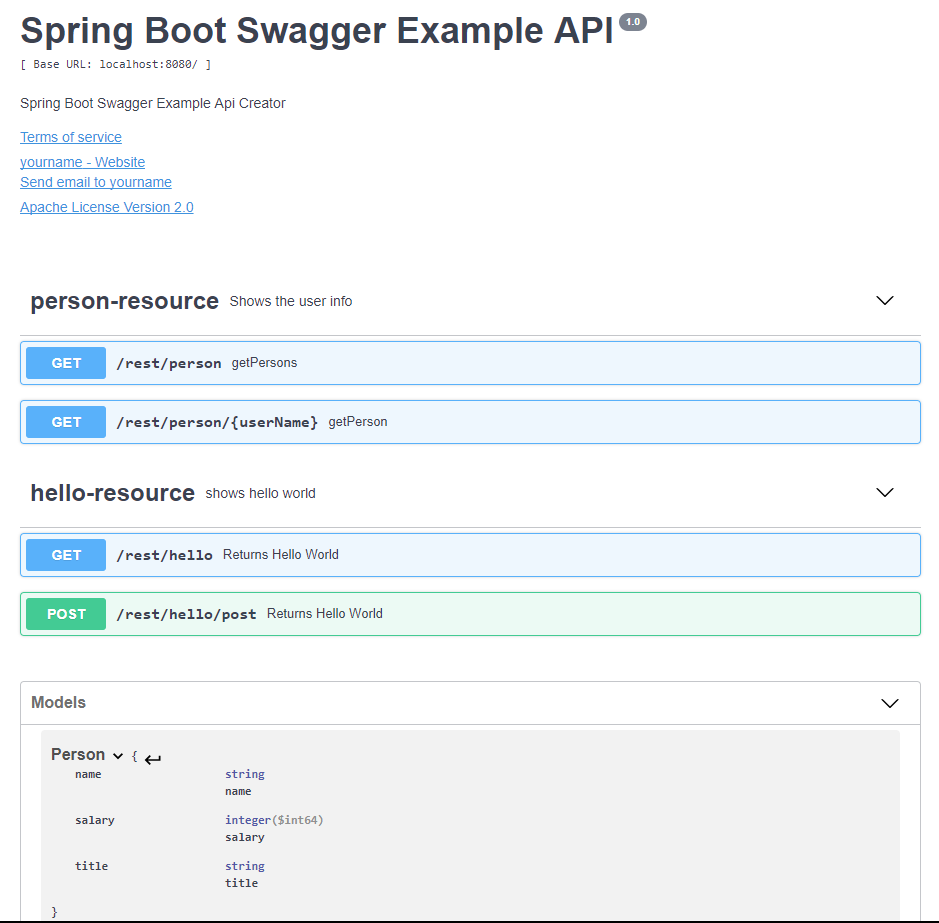
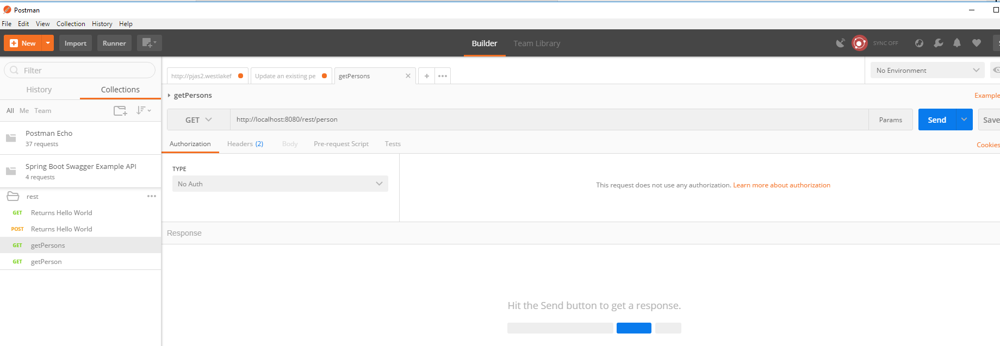

# Spring Boot integration with Swagger 2 UI

### 1 pom.xml

Added Swagger dependencies into the `pom.xml` file.
```
        <dependency>
            <groupId>io.springfox</groupId>
            <artifactId>springfox-swagger2</artifactId>
            <version>2.6.1</version>
            <scope>compile</scope>
        </dependency>

        <dependency>
            <groupId>io.springfox</groupId>
            <artifactId>springfox-swagger-ui</artifactId>
            <version>2.6.1</version>
            <scope>compile</scope>
        </dependency>
```

### 2 SwaggerConfig.java

Create swagger config class `SwaggerConfig.java`

```
import org.springframework.context.annotation.Bean;
import org.springframework.context.annotation.Configuration;
import springfox.documentation.builders.RequestHandlerSelectors;
import springfox.documentation.service.ApiInfo;
import springfox.documentation.service.Contact;
import springfox.documentation.spi.DocumentationType;
import springfox.documentation.spring.web.plugins.Docket;
import springfox.documentation.swagger2.annotations.EnableSwagger2;

import static springfox.documentation.builders.PathSelectors.regex;

@EnableSwagger2
@Configuration
public class SwaggerConfig {

    @Bean
    public Docket exampleApi() {
        return new Docket(DocumentationType.SWAGGER_2)
                .select()
                .apis(RequestHandlerSelectors.basePackage("com.bennzhang.springboot.swaggerexample"))
                .paths(regex("/rest.*"))
                .build()
                .apiInfo(metaInfo());
    }

    private ApiInfo metaInfo() {

        ApiInfo apiInfo = new ApiInfo(
                "Spring Boot Swagger Example API",
                "Spring Boot Swagger Example Api Creator",
                "1.0",
                "Terms of Service",
                new Contact("yourname", "https://github.com/yourlink",
                        "youremail@yourdomain.com"),
                "Apache License Version 2.0",
                "https://www.apache.org/licesen.html"
        );

        return apiInfo;
    }
}
```

Change the `basePackage` and `Contact` Info in your project. 

### 3 Model Api property

Add `@ApiModelProperty` annotation on model properties. 
```
import io.swagger.annotations.ApiModelProperty;
import lombok.Data;

@Data
public class Person {
    @ApiModelProperty(notes = "name")
    private String name;

    @ApiModelProperty(notes = "title")
    private String title;

    @ApiModelProperty(notes = "salary")
    private Long salary;

    public Person(){}

    public Person(String name, String title, Long salary) {
        this.name = name;
        this.title = title;
        this.salary = salary;
    }
}
```

## Result
[http://localhost:8080/v2/api-docs](http://localhost:8088/v2/api-docs) - Shows the Api docs in JSON format. 

```
{
   "swagger": "2.0",
   "info": {
      "description": "Spring Boot Swagger Example Api Creator",
      "version": "1.0",
      "title": "Spring Boot Swagger Example API",
      "termsOfService": "Terms of Service",
      "contact": {
         "name": "yourname",
         "url": "https://github.com/yourlink",
         "email": "youremail@yourdomain.com"
      },
      "license": {
         "name": "Apache License Version 2.0",
         "url": "https://www.apache.org/licesen.html"
      }
   },
   "host": "localhost:8080",
   "basePath": "/",
   "tags": [
      {
         "name": "person-resource",
         "description": "Shows the user info"
      },
      {
         "name": "hello-resource",
         "description": "shows hello world"
      }
   ],
   "paths": {
      "/rest/hello": {
         "get": {
            "tags": [
               "hello-resource"
            ],
            "summary": "Returns Hello World",
            "operationId": "helloUsingGET",
            "consumes": [
               "application/json"
            ],
            "produces": [
               "*/*"
            ],
            "responses": {
               "100": {
                  "description": "100 is the message"
               },
               "200": {
                  "description": "Successful Hello World",
                  "schema": {
                     "type": "string"
                  }
               },
               "401": {
                  "description": "Unauthorized"
               },
               "403": {
                  "description": "Forbidden"
               },
               "404": {
                  "description": "Not Found"
               }
            }
         }
      },
      "/rest/hello/post": {
         "post": {
            "tags": [
               "hello-resource"
            ],
            "summary": "Returns Hello World",
            "operationId": "helloPostUsingPOST",
            "consumes": [
               "application/json"
            ],
            "produces": [
               "*/*"
            ],
            "parameters": [
               {
                  "in": "body",
                  "name": "hello",
                  "description": "hello",
                  "required": true,
                  "schema": {
                     "type": "string"
                  }
               }
            ],
            "responses": {
               "200": {
                  "description": "OK",
                  "schema": {
                     "type": "string"
                  }
               },
               "201": {
                  "description": "Created"
               },
               "401": {
                  "description": "Unauthorized"
               },
               "403": {
                  "description": "Forbidden"
               },
               "404": {
                  "description": "Not Found"
               }
            }
         }
      },
      "/rest/person": {
         "get": {
            "tags": [
               "person-resource"
            ],
            "summary": "getPersons",
            "operationId": "getPersonsUsingGET",
            "consumes": [
               "application/json"
            ],
            "produces": [
               "*/*"
            ],
            "responses": {
               "200": {
                  "description": "OK",
                  "schema": {
                     "type": "array",
                     "items": {
                        "$ref": "#/definitions/Person"
                     }
                  }
               },
               "401": {
                  "description": "Unauthorized"
               },
               "403": {
                  "description": "Forbidden"
               },
               "404": {
                  "description": "Not Found"
               }
            }
         }
      },
      "/rest/person/{userName}": {
         "get": {
            "tags": [
               "person-resource"
            ],
            "summary": "getPerson",
            "operationId": "getPersonUsingGET",
            "consumes": [
               "application/json"
            ],
            "produces": [
               "*/*"
            ],
            "parameters": [
               {
                  "name": "userName",
                  "in": "path",
                  "description": "userName",
                  "required": true,
                  "type": "string"
               }
            ],
            "responses": {
               "200": {
                  "description": "OK",
                  "schema": {
                     "$ref": "#/definitions/Person"
                  }
               },
               "401": {
                  "description": "Unauthorized"
               },
               "403": {
                  "description": "Forbidden"
               },
               "404": {
                  "description": "Not Found"
               }
            }
         }
      }
   },
   "definitions": {
      "Person": {
         "type": "object",
         "properties": {
            "name": {
               "type": "string",
               "description": "name"
            },
            "salary": {
               "type": "integer",
               "format": "int64",
               "description": "salary"
            },
            "title": {
               "type": "string",
               "description": "title"
            }
         }
      }
   }
}
``` 

Save it into `swagger.json` File, and open it from [https://editor.swagger.io/#](https://editor.swagger.io/#), you will see something like:




## Load to Postman

And you can load to `Postman` too.  You will see your request template there. 

